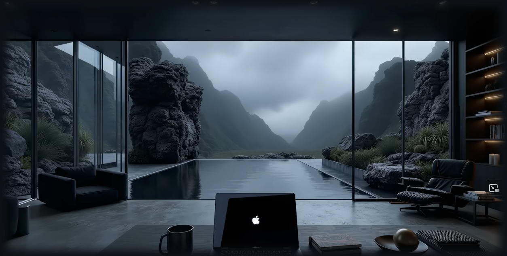

<h2>αλχημιστής</h2>

<em>
Hey, I'm αλχημιστής. 
Former Blockchain Developer, now transitioning into Web/AppSec, authorized pentesting, and security automation.
</em>

---

### Tools I'm Practicing

  
  
  
  
  
  
  
  
  
  

---

### Open Source / Work

- [All repositories](https://github.com/saynotoai?tab=repositories)
- More security-focused repositories are being built during the 56-day sprint.

